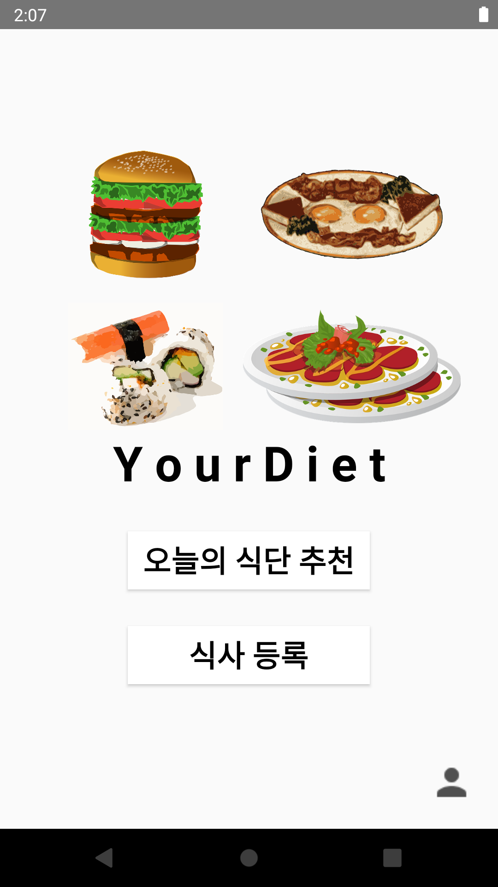
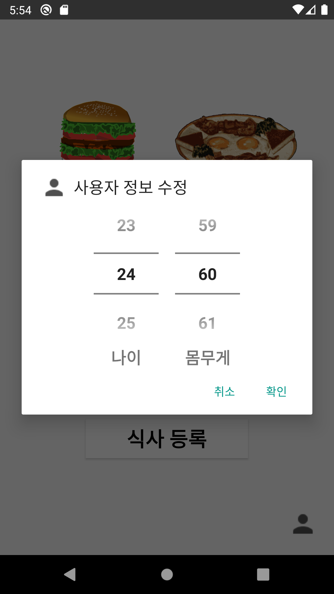
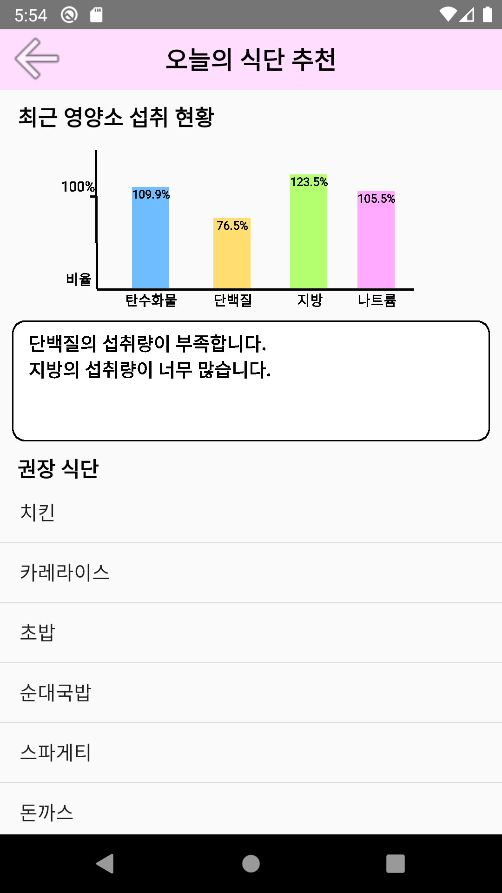
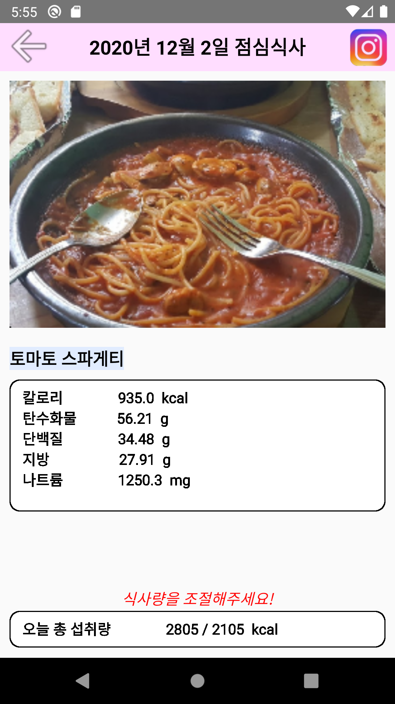
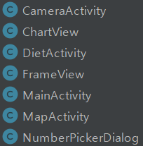

# 모바일프로그래밍
**2020년 2학기 모바일프로그래밍 (가)반 5팀** **[20170375 오승원, 20170400 최의철]**

    Android Studio 3.5.1 및 AVD: Android 10.0(Q)

## 기획안
+ [음식사진 분석 및 식단추천 앱 개발 제안](https://github.com/20170375/Android20/blob/main/%EC%9D%8C%EC%8B%9D%EC%82%AC%EC%A7%84%20%EB%B6%84%EC%84%9D%20%EB%B0%8F%20%EC%8B%9D%EB%8B%A8%EC%B6%94%EC%B2%9C%20%EC%95%B1%20%EA%B0%9C%EB%B0%9C%20%EC%A0%9C%EC%95%88.md)

## 어플 구동 화면
**처음 어플을 키면 버튼이 3개 보인다.** "오늘의 식단 추천", "식사 등록", "사용자 정보 변경"

**화면 우측 하단 "사용자 정보 변경" 버튼을 클릭하면 나이, 몸무게를 설정할 수 있다.**

     

** **

### 1. 오늘의 식단 추천

**화면에 섭취한 영양소 정보를 차트로 보여주고, 이 차트를 기반으로 추천 식단 리스트를 보여준다.**

**리스트에서 음식을 선택하면 근처에 있는 음식점을 검색하고 이를 보여준다**

     

** **

### 2. 식사 등록

**우측 상단 카메라 버튼을 누르면 갤러리 또는 카메라를 선택하는 메뉴가 나타난다.**

**갤러리에서 샘플 이미지를 가져오자.** 음식 사진 분석 알고리즘**을 통해 어떤 음식인지 식별하고 이 음식의 영양정보를 화면에 보여준다.**

**이후 섭취한 영양소 정보를 최신화하고 나면, 화면 하단 오늘 칼로리 섭취량이 업데이트 된 것을 확인할 수 있다.**

**우측 상단 카메라 버튼이 [Instagram](https://www.instagram.com/) 버튼으로 변경된 것을 볼 수 있는데, 이 버튼을 누르면** #YourDiet **해시태그와 함께 아주 쉽게 인스타그램에 업로드할 수 있다.**

               

## 코드 계층도
     

## TO DO:
+ **사용자 정보 변경 버튼**
    + txt파일 저장기능 
+ **칼로리 섭취량 계산기 함수**
    + 권장 칼로리 섭취량 계산후 화면에 나타내기
+ **카메라로 찍은 사진 사용 구현**
+ **맵View Gps기반 구현**
  + GPS 접근 권한 manifest
  + 선택된 "음식" 식당 맵 검색 & 리스트에 어댑터로 만들어 출력
  + 리스트에서 식당 onClick시 맵에 연동
+ **음식 DB xml 생성**
  + 음식 몇개만 샘플form 만들기 (~*식약처에서 영양소DB 가져오면 되지만 굳이 x*~)
+ **인스타그램 버튼 활성화**
  + [#YourDiet](https://www.instagram.com/explore/tags/YourDiet/) 해시태그가 이미 있다?

## 참고
+ [[ALTools블로그] 다이어트 카메라 AI 어플 관련 ](https://blog.naver.com/estpublic/221649788043)

## 이미지 출처:
+ [스파게티 Google지도](https://www.google.co.kr/maps/search/%EC%8A%A4%ED%8C%8C%EA%B2%8C%ED%8B%B0/@37.4945461,126.956212,16.25z)
+ [뚝배기 스파게티 Google지도](https://www.google.co.kr/maps/place/%EB%9A%9D%EB%B0%B0%EA%B8%B0%EC%8A%A4%ED%8C%8C%EA%B2%8C%ED%8B%B0/@37.4947479,126.95682,16z/data=!4m8!1m2!2m1!1z7Iqk7YyM6rKM7Yuw!3m4!1s0x357ca1d403742b15:0x3da897145f0419c9!8m2!3d37.4946287!4d126.9589658)
+ [뚝배기 스파게티 네이버지도](https://map.naver.com/v5/search/%EC%8A%A4%ED%8C%8C%EA%B2%8C%ED%8B%B0/place/1246383729?c=14132389.6091893,4508314.4503595,15,0,0,0,dh&placePath=%3F%2526)
+ [햄버거 일러스트](https://pixabay.com/ko/vectors/%ED%96%84%EB%B2%84%EA%B1%B0-%EB%94%94%EB%9F%AD%EC%8A%A4-%EA%B1%B0-%EB%8C%80-%ED%95%9C-307349/)
+ [계란 일러스트](https://pixabay.com/ko/vectors/%EC%95%84%EC%B9%A8-%EC%8B%9D%EC%82%AC-%EB%8B%AC%EA%B1%80-%ED%86%A0%EC%8A%A4%ED%8A%B8-32473/)
+ [스시 일러스트](https://pixabay.com/ko/vectors/%EC%B4%88%EB%B0%A5-%EC%8A%A4%EC%8B%9C-%EB%A1%A4-%EB%9D%BC%EC%9D%B4%EC%8A%A4-%EC%9D%BC%EB%B3%B8%EC%96%B4-296521/)
+ [식사 일러스트](https://pixabay.com/ko/vectors/%EC%A0%91%EC%8B%9C-%EC%9D%8C%EC%8B%9D-%EC%8B%9D%EC%82%AC-%EC%A0%80%EB%85%81-%EC%8B%9D%EC%82%AC-576381/)
+ [앱 아이콘 chef](https://pixabay.com/ko/vectors/%EC%9A%94%EB%A6%AC%EC%82%AC-%EC%95%9E-%ED%98%9C%ED%83%9D-%EA%B5%BD%EA%B3%A0-%EC%82%AC%EB%9E%8C-2409158/)
