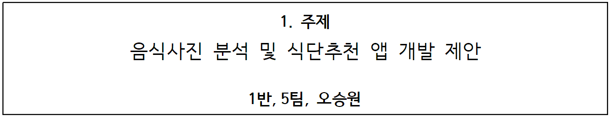
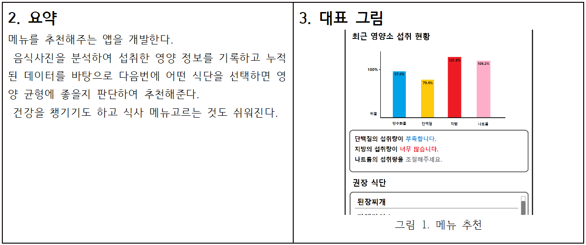
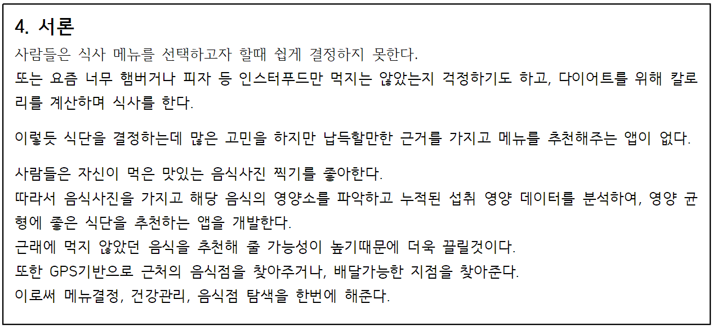
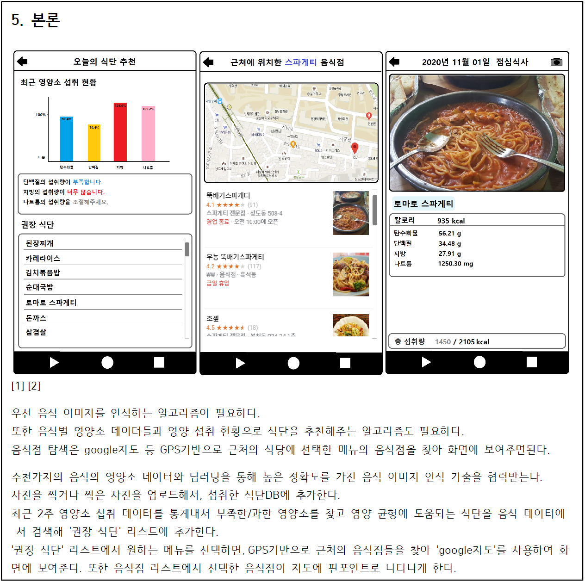
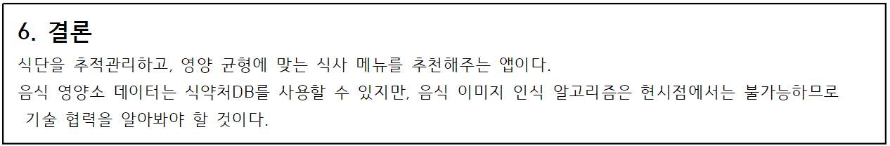

## 7. 출처
* [스파게티](https://www.google.co.kr/maps/search/%EC%8A%A4%ED%8C%8C%EA%B2%8C%ED%8B%B0/@37.4947477,126.95682,16z/data=!3m1!4b1)
* [뚝배기 스파게티 네이버지도](https://www.google.co.kr/maps/place/%EB%9A%9D%EB%B0%B0%EA%B8%B0%EC%8A%A4%ED%8C%8C%EA%B2%8C%ED%8B%B0/@37.4947479,126.95682,16z/data=!4m8!1m2!2m1!1z7Iqk7YyM6rKM7Yuw!3m4!1s0x357ca1d403742b15:0x3da897145f0419c9!8m2!3d37.4946287!4d126.9589658)
