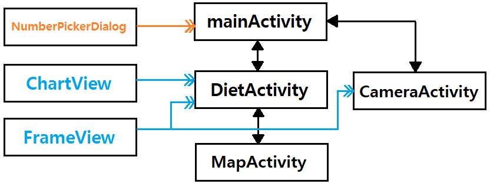

## [클래스](https://github.com/20170375/Android20/tree/main/YourDiet/app/src/main/java/com/cookandroid/yourdiet)

+ **Activity**

  + MainActivity.java 
      
  + DietActivity.java

  + MapActivity.java

  + CameraActivity.java

+ **View**

  + ChartView.java

  + FrameView.java

+ **Dialog**

  + NumberPickerDialog.java

## [레이아웃](https://github.com/20170375/Android20/tree/main/YourDiet/app/src/main/res/layout)

+ **activity_main.xml**    (MainActivity)

+ **activity_diet.xml**    (DietActivity)

+ **activity_map.xml**    (MapActivity)

+ **activity_camera.xml**    (CameraActivity)

+ **dialog.xml**    (NumberPickerDialog)
